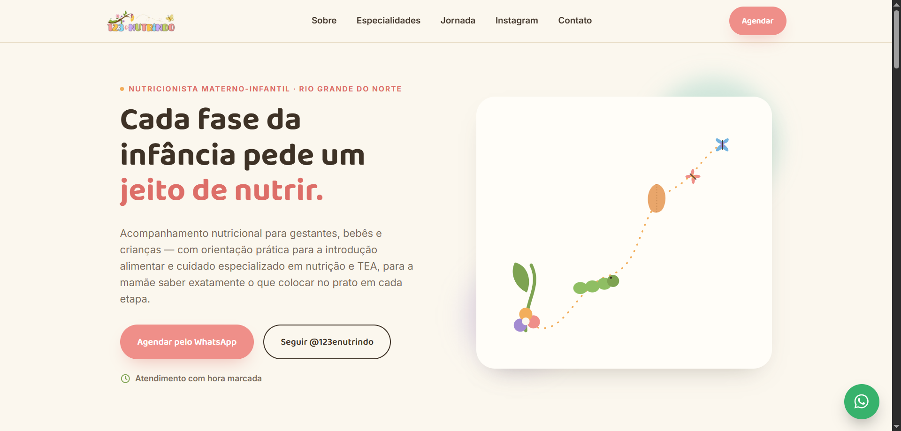

# 🌿 123 e Nutrindo


Landing Page desenvolvida para uma nutricionista materno-infantil, com foco em **design moderno**, **responsividade**, **acessibilidade** e **boa experiência do usuário**.

O projeto foi desenvolvido utilizando apenas tecnologias nativas da web (**HTML5, CSS3 e JavaScript**), sem o uso de frameworks, como forma de praticar os fundamentos do desenvolvimento Front-end.

---

# 🚧 Status do Projeto

✅ Projeto concluído e disponível para demonstração.

---

# 🚀 Demonstração

🔗 **Acesse o projeto online**

> https://damiaooliver.github.io/123-e-nutrindo/

---

# 📸 Preview



---

# ✨ Funcionalidades

- ✅ Layout totalmente responsivo
- ✅ Header fixo
- ✅ Menu Mobile
- ✅ Navegação suave entre as seções
- ✅ Botão flutuante do WhatsApp
- ✅ Animações ao rolar a página
- ✅ Interface moderna
- ✅ Estrutura semântica em HTML5
- ✅ Código organizado

---

# 🛠 Tecnologias Utilizadas

- HTML5
- CSS3
- JavaScript
- Google Fonts

---

# 📂 Estrutura do Projeto

```text
123-e-nutrindo/
│
├── index.html
├── README.md
├── .gitignore
│
├── assets/
│   ├── css/
│   │   └── style.css
│   │
│   ├── js/
│   │   └── script.js
│   │
│   └── images/
│
└── screenshots/
    └── home.png
```

---

# 🎯 Objetivo

Este projeto foi desenvolvido com o objetivo de praticar e consolidar conhecimentos em:

- HTML Semântico
- CSS Moderno
- Flexbox
- CSS Grid
- Responsividade
- Organização de arquivos
- JavaScript para interatividade
- Boas práticas de desenvolvimento Front-end

---

# 📱 Responsividade

O layout foi desenvolvido para proporcionar uma boa experiência em diferentes dispositivos:

- 💻 Desktop
- 💻 Notebook
- 📱 Smartphones
- 📱 Tablets

---

# 💡 Principais Aprendizados

Durante o desenvolvimento deste projeto foram praticados conceitos importantes como:

- Estruturação semântica utilizando HTML5
- Organização de layouts com Flexbox e CSS Grid
- Separação entre HTML, CSS e JavaScript
- Responsividade para diferentes tamanhos de tela
- Manipulação do DOM com JavaScript
- Organização de projetos Front-end

---

# 📈 Melhorias Futuras

- [ ] Implementar formulário funcional
- [ ] Melhorar SEO
- [ ] Adicionar modo escuro
- [ ] Melhorar acessibilidade (WCAG)
- [ ] Otimizar imagens
- [ ] Adicionar animações mais avançadas

---

# 👨‍💻 Autor

**Damião Oliveira**

Desenvolvedor Front-end em formação, estudando HTML, CSS, JavaScript e Python, com foco na criação de interfaces modernas, responsivas e intuitivas.

### GitHub

https://github.com/damiaooliver

---

## ⭐ Gostou do projeto?

Se este projeto foi interessante para você, deixe uma ⭐ no repositório. Ela ajuda bastante a divulgar o trabalho.